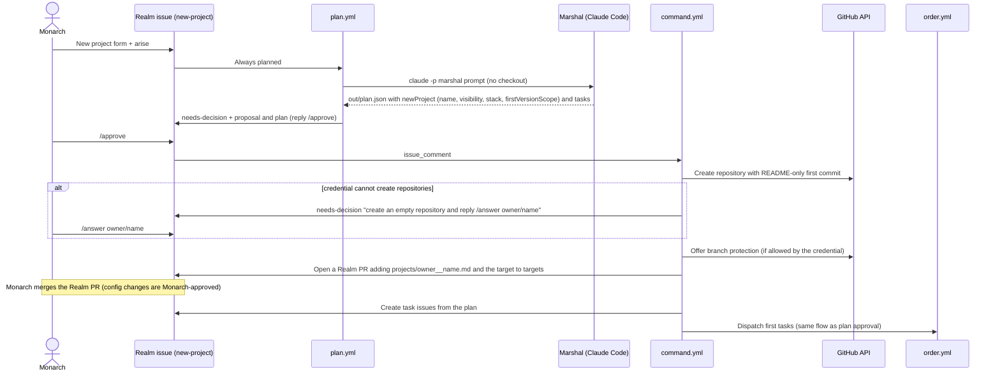

# New Project

Milestone 5. Repository creation depends on a spike: whether the configured credential can create repositories on the Monarch's account.

```mermaid
sequenceDiagram
  actor Monarch
  participant Realm as Realm issue (new-project)
  participant P as plan.yml
  participant Marshal as Marshal (Claude Code)
  participant CMD as command.yml
  participant GH as GitHub API
  participant WF as order.yml

  Monarch->>Realm: New project form + arise
  Realm->>P: Always planned
  P->>Marshal: claude -p marshal prompt (no checkout)
  Marshal-->>P: out/plan.json with newProject (name, visibility, stack, firstVersionScope) and tasks
  P->>Realm: needs-decision + proposal and plan (reply /approve)
  Monarch->>Realm: /approve
  Realm->>CMD: issue_comment
  CMD->>GH: Create repository with README-only first commit
  alt credential cannot create repositories
    CMD->>Realm: needs-decision "create an empty repository and reply /answer owner/name"
    Monarch->>Realm: /answer owner/name
  end
  CMD->>GH: Offer branch protection (if allowed by the credential)
  CMD->>Realm: Open a Realm PR adding projects/owner__name.md and the target to targets
  Note over Monarch,Realm: Monarch merges the Realm PR (config changes are Monarch-approved)
  CMD->>Realm: Create task issues from the plan
  CMD->>WF: Dispatch first tasks (same flow as plan approval)
```
