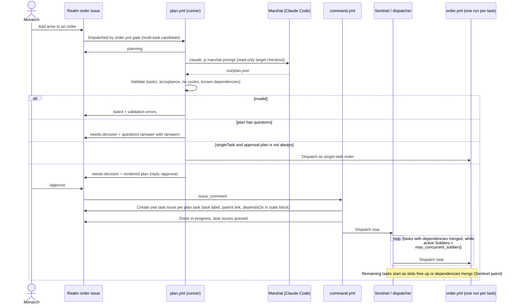

# Plan Approval And Dispatch

Milestone 4.

```mermaid
sequenceDiagram
  actor Monarch
  participant Realm as Realm order issue
  participant P as plan.yml (runner)
  participant Marshal as Marshal (Claude Code)
  participant CMD as command.yml
  participant S as Sentinel / dispatcher
  participant WF as order.yml (one run per task)

  Monarch->>Realm: Add arise to an order
  Realm->>P: Dispatched by order.yml gate (multi-task candidate)
  P->>Realm: planning
  P->>Marshal: claude -p marshal prompt (read-only target checkout)
  Marshal-->>P: out/plan.json
  P->>P: Validate (tasks, acceptance, no cycles, known dependencies)
  alt invalid
    P->>Realm: failed + validation errors
  else plan has questions
    P->>Realm: needs-decision + questions (answer with /answer)
  else singleTask and approval.plan is not always
    P->>WF: Dispatch as single-task order
  else
    P->>Realm: needs-decision + rendered plan (reply /approve)
    Monarch->>Realm: /approve
    Realm->>CMD: issue_comment
    CMD->>Realm: Create one task issue per plan task (task label, parent link, dependsOn in state block)
    CMD->>Realm: Order in-progress, task issues queued
    CMD->>S: Dispatch now
    loop tasks with dependencies merged, while active Soldiers < max_concurrent_soldiers
      S->>WF: Dispatch task
    end
    Note over S,WF: Remaining tasks start as slots free up or dependencies merge (Sentinel patrol)
  end
```
