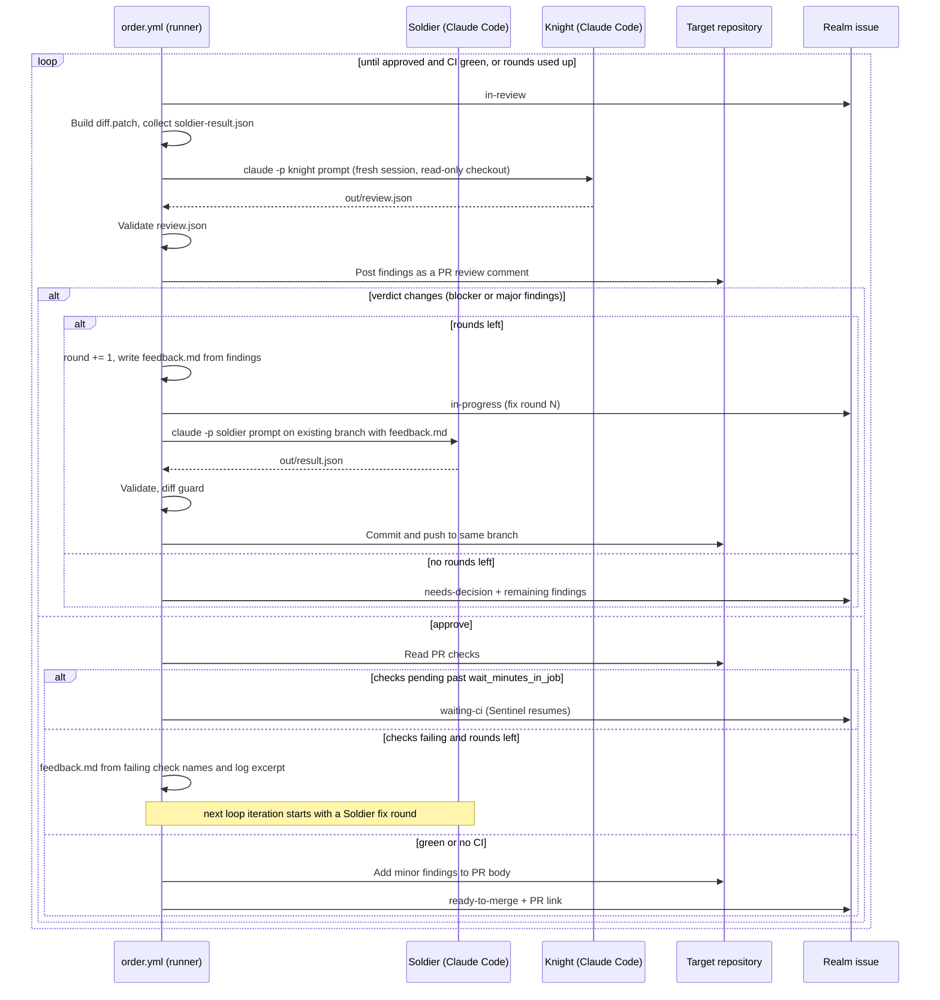

# Review And Fix Loop

Milestone 2. Runs inside the same `work` job right after the Soldier's first push.

```mermaid
sequenceDiagram
  participant WF as order.yml (runner)
  participant Soldier as Soldier (Claude Code)
  participant Knight as Knight (Claude Code)
  participant Target as Target repository
  participant Realm as Realm issue

  loop until approved and CI green, or rounds used up
    WF->>Realm: in-review
    WF->>WF: Build diff.patch, collect soldier-result.json
    WF->>Knight: claude -p knight prompt (fresh session, read-only checkout)
    Knight-->>WF: out/review.json
    WF->>WF: Validate review.json
    WF->>Target: Post findings as a PR review comment
    alt verdict changes (blocker or major findings)
      alt rounds left
        WF->>WF: round += 1, write feedback.md from findings
        WF->>Realm: in-progress (fix round N)
        WF->>Soldier: claude -p soldier prompt on existing branch with feedback.md
        Soldier-->>WF: out/result.json
        WF->>WF: Validate, diff guard
        WF->>Target: Commit and push to same branch
      else no rounds left
        WF->>Realm: needs-decision + remaining findings
      end
    else approve
      WF->>Target: Read PR checks
      alt checks pending past wait_minutes_in_job
        WF->>Realm: waiting-ci (Sentinel resumes)
      else checks failing and rounds left
        WF->>WF: feedback.md from failing check names and log excerpt
        Note over WF,Soldier: next loop iteration starts with a Soldier fix round
      else green or no CI
        WF->>Target: Add minor findings to PR body
        WF->>Realm: ready-to-merge + PR link
      end
    end
  end
```
