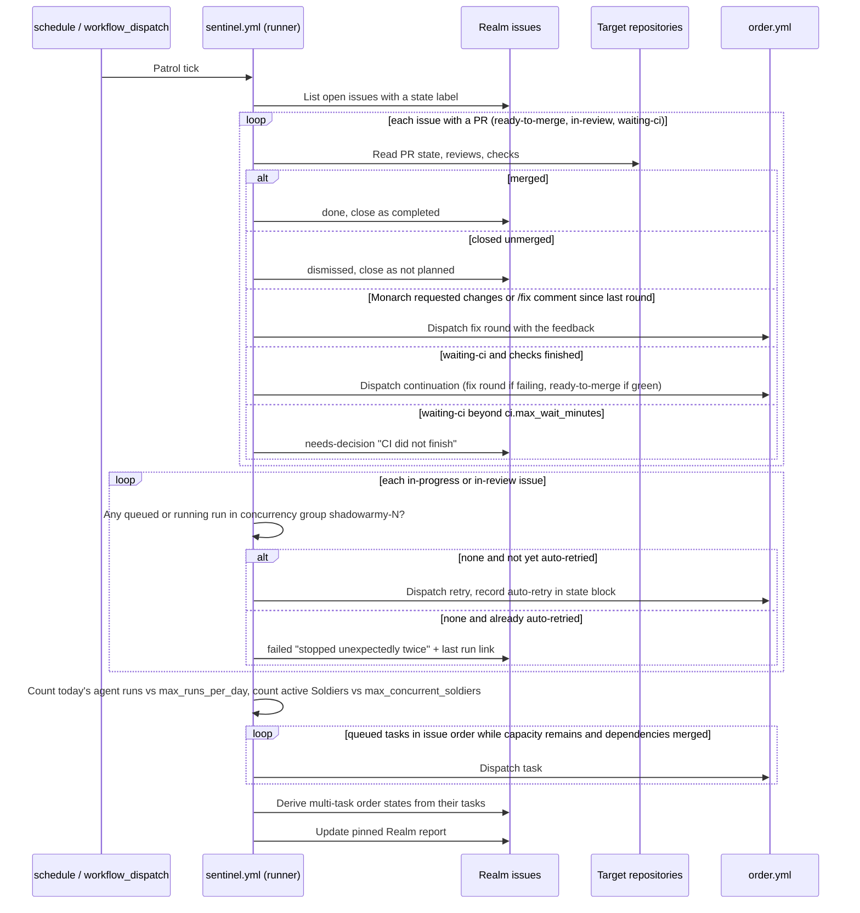

# Sentinel Patrol

Milestone 3. Deterministic; no agent. Every step is idempotent so missed or delayed ticks are harmless.

```mermaid
sequenceDiagram
  participant Cron as schedule / workflow_dispatch
  participant S as sentinel.yml (runner)
  participant Realm as Realm issues
  participant Target as Target repositories
  participant WF as order.yml

  Cron->>S: Patrol tick
  S->>Realm: List open issues with a state label
  loop each issue with a PR (ready-to-merge, in-review, waiting-ci)
    S->>Target: Read PR state, reviews, checks
    alt merged
      S->>Realm: done, close as completed
    else closed unmerged
      S->>Realm: dismissed, close as not planned
    else Monarch requested changes or /fix comment since last round
      S->>WF: Dispatch fix round with the feedback
    else waiting-ci and checks finished
      S->>WF: Dispatch continuation (fix round if failing, ready-to-merge if green)
    else waiting-ci beyond ci.max_wait_minutes
      S->>Realm: needs-decision "CI did not finish"
    end
  end
  loop each in-progress or in-review issue
    S->>S: Any queued or running run in concurrency group shadowarmy-N?
    alt none and not yet auto-retried
      S->>WF: Dispatch retry, record auto-retry in state block
    else none and already auto-retried
      S->>Realm: failed "stopped unexpectedly twice" + last run link
    end
  end
  S->>S: Count today's agent runs vs max_runs_per_day, count active Soldiers vs max_concurrent_soldiers
  loop queued tasks in issue order while capacity remains and dependencies merged
    S->>WF: Dispatch task
  end
  S->>Realm: Derive multi-task order states from their tasks
  S->>Realm: Update pinned Realm report
```
