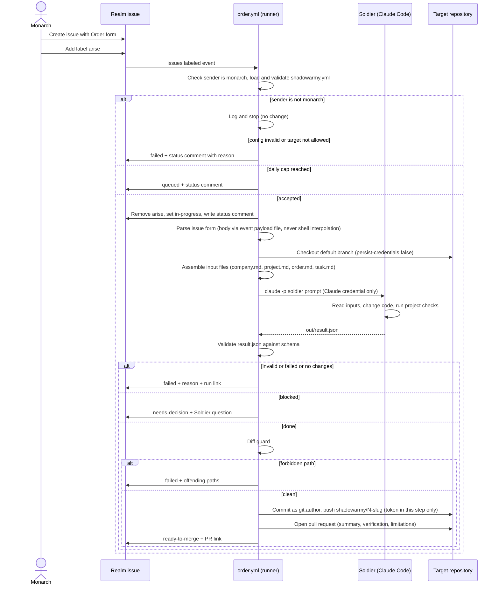

# Single-Task Order

Milestone 1 (without the Knight; the Knight is added in milestone 2, see [review and fix loop](review-and-fix-loop.md)).

```mermaid
sequenceDiagram
  actor Monarch
  participant Realm as Realm issue
  participant WF as order.yml (runner)
  participant Agent as Soldier (Claude Code)
  participant Target as Target repository

  Monarch->>Realm: Create issue with Order form
  Monarch->>Realm: Add label arise
  Realm->>WF: issues labeled event
  WF->>WF: Check sender is monarch, load and validate shadowarmy.yml
  alt sender is not monarch
    WF->>WF: Log and stop (no change)
  else config invalid or target not allowed
    WF->>Realm: failed + status comment with reason
  else daily cap reached
    WF->>Realm: queued + status comment
  else accepted
    WF->>Realm: Remove arise, set in-progress, write status comment
    WF->>WF: Parse issue form (body via event payload file, never shell interpolation)
    WF->>Target: Checkout default branch (persist-credentials false)
    WF->>WF: Assemble input files (company.md, project.md, order.md, task.md)
    WF->>Agent: claude -p soldier prompt (Claude credential only)
    Agent->>Agent: Read inputs, change code, run project checks
    Agent-->>WF: out/result.json
    WF->>WF: Validate result.json against schema
    alt invalid or failed or no changes
      WF->>Realm: failed + reason + run link
    else blocked
      WF->>Realm: needs-decision + Soldier question
    else done
      WF->>WF: Diff guard
      alt forbidden path
        WF->>Realm: failed + offending paths
      else clean
        WF->>Target: Commit as git.author, push shadowarmy/N-slug (token in this step only)
        WF->>Target: Open pull request (summary, verification, limitations)
        WF->>Realm: ready-to-merge + PR link
      end
    end
  end
```
